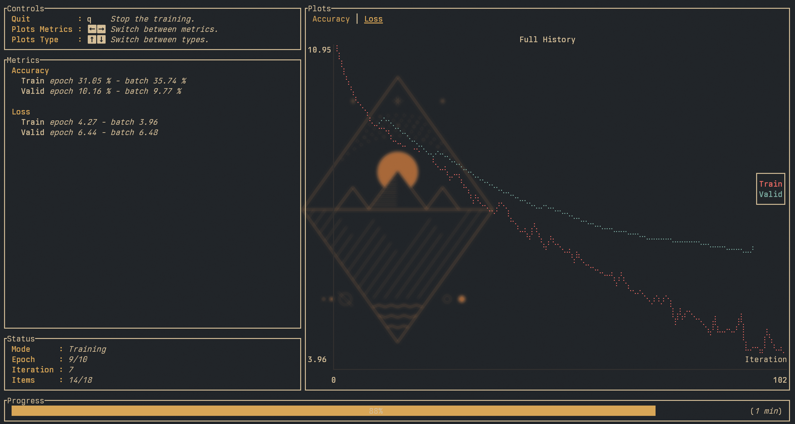

# Rust GPT-2

GPT 2 written in Rust using [Burn](https://github.com/tracel-ai/burn).



# Examples

## Train

```bash
cargo run --release --example train
```

---

## Infer

### 1. Load OpenAI weights (WIP)

**Note**: This is broken right now, probably due to mismatches between the original 
model and my own implementation. I have not been able to spot the issue yet. Until
fixed, the inference just outputs nonsense.

Download the weights:
```bash
python3 scripts/gpt2_download.py  # requires tensorflow, safetensors and tqdm installed
```

This downloads the original Tensorflow weights and converts them into a `safetensors`
file, which is save to `gpt2/gpt2.safetensors`.

### 2. Run the Inference
```bash
cargo run --release --example infer -- --input "Hey how are you "
```

